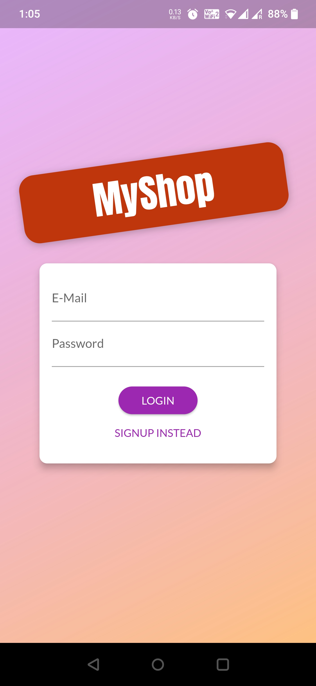
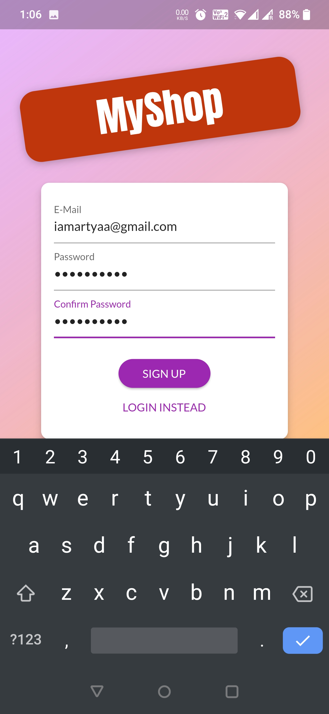
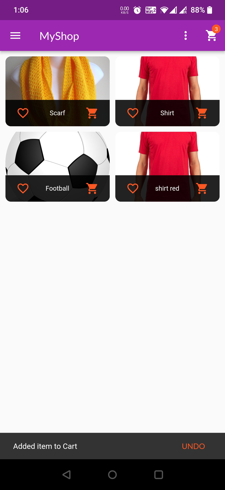
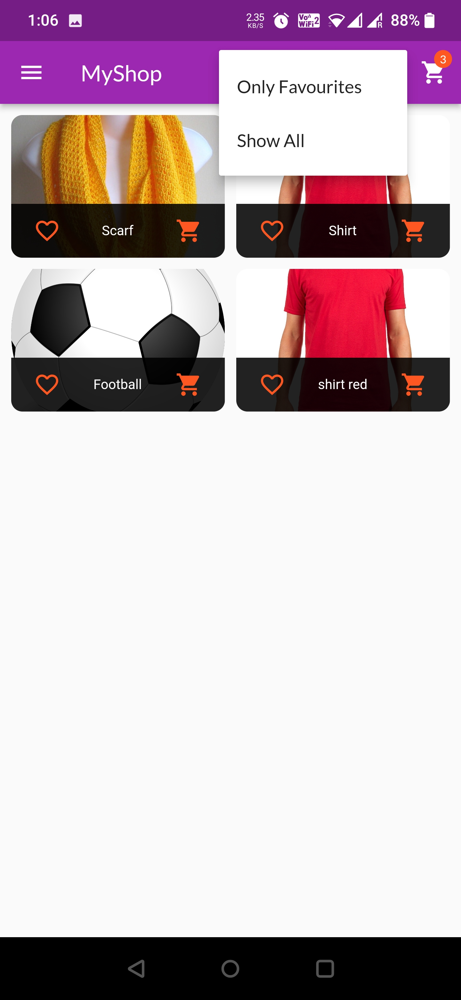
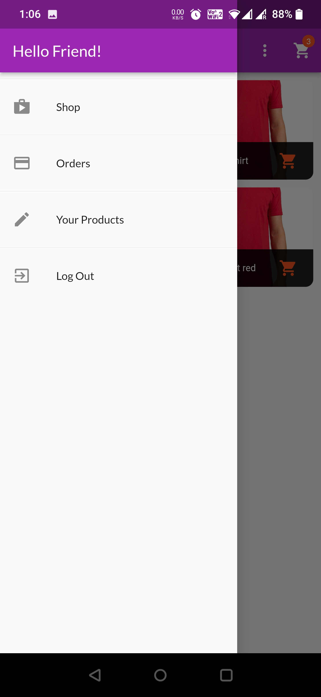
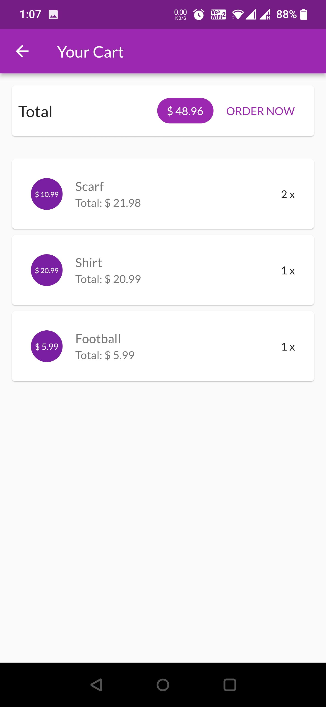
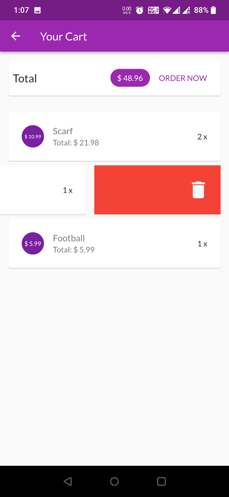
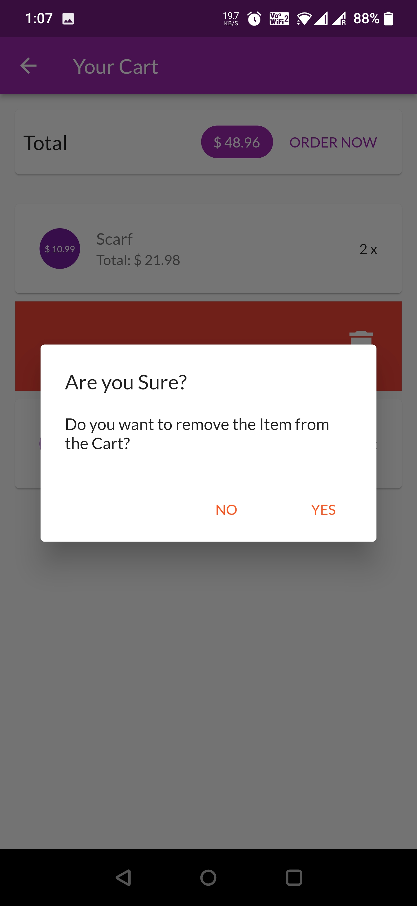
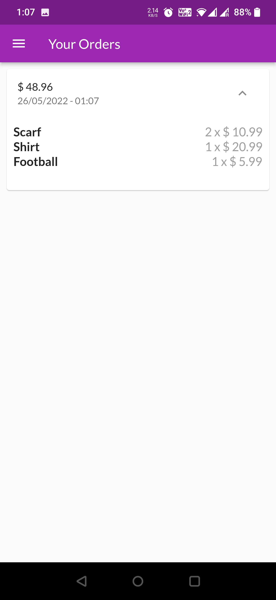
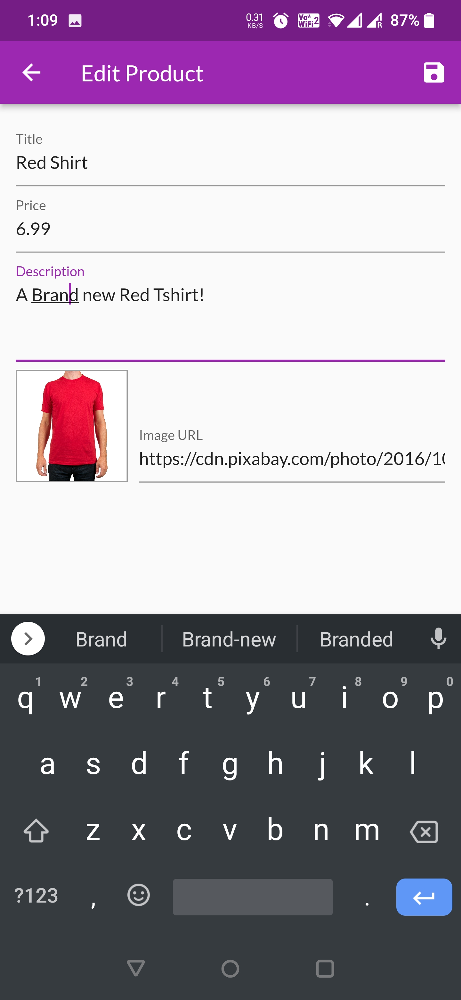

# Ekart

A simple Shopping app built in similarity with any e-commerce app  with a cleaner UI.

## Key Points

- Built with **Flutter & Dart** on the frontend using **Material UI**
- Similar screen layout as that of an e-commerce app with features like adding items to cart, order item, buy now, manage items uploaded by user,  Login/ Sign Up authentication, adding items to wish list & many more coming soon
- Made with an aim to incoperate various **Flutter Widgets** & display proficiency in Flutter & Dart internals
- **RealTime Firebase database** for storing & fetching data | **Firebase** for setting up email/password authentication

## ScreenShots

 |  |   |
 | 
---
 |  |   |
 | 

## Created & Maintained by

### **Amartya Yadav**
---
